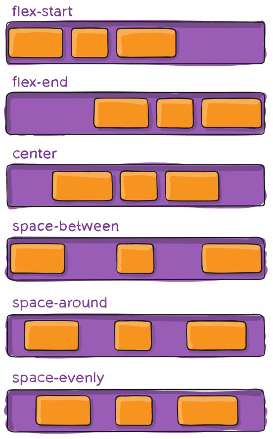

Департамент образования и науки города Москвы

ГАПОУ Колледж предпринимательства №11

Центр информационно-коммуникационных технологий

**Аналитический отчёт**

по дисциплине: “Исследовательская и проектная деятельность”

на тему: <u>Разработка обучающей игры по использованию технологии
«Flex-box»</u>

<table>
<colgroup>
<col style="width: 55%" />
<col style="width: 44%" />
</colgroup>
<thead>
<tr class="header">
<th>
Выполнили:

студенты группы ИСИП-31

Ефременко Алексей – менеджер

Митина Эллина – зам. менеджера

Политов Егор

Маркусь Евгений
</th>
<th>
Проверил:

Преподаватель

Е.Ю. Ильина
</th>
</tr>
</thead>
<tbody>
</tbody>
</table>

Москва, 2023 г.

**Содержание**

[Введение [3](#введение)](#введение)

[Глава 1. Натуральное описание [5](#_Hlk133524194)](#_Hlk133524194)

[Глава 2. Сбор и анализ информации
[8](#глава-2.-сбор-и-анализ-информации)](#глава-2.-сбор-и-анализ-информации)

[Выводы [29](#_Toc153232816)](#_Toc153232816)

[Рекомендации [31](#_Toc134739382)](#_Toc134739382)

[Заключение [32](#_Toc153232820)](#_Toc153232820)

[Приложение к аналитическому отчету
[33](#_Toc134739384)](#_Toc134739384)

#  Введение

Flex-box - это технология CSS (для создания сайта), которая позволяет
легко и гибко управлять расположением элементов на веб-странице. Она
позволяет создавать адаптивные макеты, которые легко адаптируются к
различным размерам экранов и устройств.

Проект предназначен для людей, только начинающих свой путь в frontend
разработке. Этот материал поможет, как новичкам начать свое обучение,
так и опытным разработчикам повторить ранее изученный материал.

Актуальностью проекта для команды является возможность узнать подробнее
о различных свойствах Flex-box и улучшить свои навыки по работе с данной
технологией. Проект будет нести в себе не только теоретические знания,
но и возможность использования их на практике.

Цель проекта - создать обучающую игру для людей, которые хотят грамотно
и быстро научиться технологии Flex-box. 

В связи с поставленной целью, необходимо решить следующие задачи:

1.  Выбрать тему проекта;

2.  Распределиться по группам;

3.  Определить роли в группе;

4.  Установить рабочее расписание:

    1.  Распределить работу между участниками группы;

    2.  Поставить ограничение по времени для выполнения рабочих задач.

5.  Выбрать источники информации;

6.  Выбрать инструменты, с помощью которых будет создаваться обучающая
    игра:

    1.  Текстовый редактор;

    2.  Фоторедакторы;

    3.  Приложения для создания кода;

    4.  Общие приложения для работы команды.

7.  Создать дизайн игры:

    1.  Подобрать текстуры и дизайн;

8.  Написать практическую часть с помощью дополнительных источников
    информации;

9.  Реализовать сайт с помощью ранее выполненных задач;

10. Ввести конечные правки;

11. Защитить аналитический отчет.

Объектом исследования в данном проекте является технология Flex-box.

Предметом исследования является обучающая игра, основанная на
использовании технологии Flex-box.

Субъект исследования: проектная команда.

Методы исследования, которые используются в проекте: Кабинетный,
разведочный, описательный, моделирование и метод экспертных оценок.

Глава 1. Натуральное
описание

**05.09.2023-19.09.2023**

По дисциплине «Исследовательская и проектная деятельность» было дано
задание придумать темы проектов. 

Участники собрались в команду, состоящую из:

1.  Менеджер команды – Ефременко Алексей;

2.  Зам. Менеджера команды – Митина Эллина;

3.  Участник команды – Политов Егор;

4.  Участник команды – Маркусь Евгений.

> Для групповой работы были выбраны темы:

1.  Сайт про технологию Flex-box;

2.  Сайт здорового питания (с подсчётом калорий);

3.  Сайт по оптимизации Windows;

4.  Разработка обучающей игры по использованию технологии Flex-box;

5.  Интерактивный сайт по финансовой грамотности;

6.  Сайт инструкция по VS Code;

7.  Сайт по элементам высшей математики;

> Преподавателем была одобрена тема №4.

**19.09.2023-03.10.2023**

Участники обсудили тему проекта и сформировали команду.

Для организационной работы и оперативной связи между командой Ефременко
Алексей создал беседу в Telegram. 

Совместно с командой обдумали план работы и ход выполнения.

Ефременко Алексей распределил работу между участниками в соответствии с
их личными качествами и пожеланиями, а также редактировал конечный
результат работы команды на данном этапе.

Митина Эллина наполняла и редактировала аналитический отчёт, участвовала
в обсуждении проекта, собирала информацию, предлагала идеи.

Политов Егор написал блок «Введение», расписывал цель и задачи проекта в
соответствии с поставленными требованиями, редактировал документ вместе
с Ефременко Алексеем.

Маркусь Евгений определил объект, предмет, субъект исследования, а также
его методы. Вместе с остальными участниками обсуждал идею проекта.

**03.10.2023-17.10.2023**

В данный период участники команды занимались следующими задачами:

Ефременко Алексей руководил процессом создания игры, нашел музыку для
уровней, помогал остальным участникам команды.

Митина Эллина редактировала аналитический отчет, придумывала вопросы и
задания к игре.

Политов Егор редактировал аналитический отчет, помогал остальным
участникам команды.

Маркусь Евгений занимался разработкой игры, делал новые уровни.

**18.10.2023-31.10.2023**

В данный период участники команды занимались следующими задачами:

Ефременко Алексей руководил процессом создания игры, редактировал
аналитический отчет.

Митина Эллина редактировала аналитический отчет и придумывала в каком
порядке будут идти задания в зависимости от их сложности понимания.

Политов Егор участвовал в редактировании аналитического отчета, помогал
в разработке игры.

Маркусь Евгений занимался разработкой игры и продумывал логику поведения
Flex-box.

**31.10.2023-14.11.2023**

В данный период участники команды занимались следующими задачами:

Ефременко Алексей руководил процессом создания игры, редактировал
аналитический отчет.

Митина Эллина участвовала в обсуждении проекта, редактировала
аналитический отчет, придумывала вопросы и задания к игре.

Политов Егор прорабатывал сюжет игры, участвовал в редактировании
аналитического отчета, помогал в разработке игры.

Маркусь Евгений занимался разработкой, анализировал проблемы движков,
выбирал следующий.

**14.11.2023-28.11.2023**

В данный промежуток времени участники команды дописали выводы,
рекомендации и заключение.

Ефременко Алексей и Митина Эллина редактировали аналитический отчет,
писали выводы, рекомендации и заключение.

Политов Егор и Маркусь Евгений вносили правки в игру, доделывали
конечный продукт, помогали редактировать аналитический отчет.

**28.11.2023-12.12.2023**

В данный промежуток времени участники команды готовятся к защите
аналитического отчета, вносят правки в конечный продукт и отчет.

#  Глава 2. Сбор и анализ информации

Обучающая игра — программное обеспечение, тренирующее и обучающее
человека в игровом режиме. Может применяться как для обучения, так и для
развлечения.

Задача 5 - Выбор источников информации:

Задача 6 - Выбрать инструменты, с помощью которых будет создаваться
обучающая игра:

1.  Текстовый редактор: Блокнот и txt файл;

2.  Фото редакторы: Movavi Photo Editor, Figma;

3.  Приложения для создания кода; VS Code;

4.  Общие приложения для работы команды: Discord, Telegram.

Задача 7 - Создание дизайна игры при помощи Godot editor. Разработан
дизайн первого уровня игры, его структура.

Задача 7.1 - Подобрать текстуры и дизайн:

В проекте важную роль играют текстуры и дизайн. Их правильный выбор
может существенно повлиять на восприятие игры игроками.

При помощи сайта itch.io (<https://itch.io/>) были определены основные
текстуры игры.

Задача 8 - Написать практическую часть с помощью дополнительных
источников информации:

**Введение**

**Что такое технология Flex-box?**

Flex-box (или просто flex) — это способ позиционирования элементов в
CSS. С помощью этой функции можно быстро и легко описывать, как будет
располагаться тот или иной блок на веб-странице. Элементы выстраиваются
по заданной оси и автоматически распределяются согласно настройкам.
Логотип Flex-box. В верстке есть такое понятие, как сетка, или лэйаут
(layout). Это то, как блоки — крупные и мелкие — расположены на
странице.
(<https://blog.skillfactory.ru/glossary/flexbox/?ysclid=lnt7o9z98m144159095>)

**Для чего нужны Flex-box?**

Это модуль CSS, который позволяет удобно управлять расположением,
порядком, размерами и отступами между элементами веб-страницы. Сайты,
свёрстанные «флексами», получаются адаптивными, то есть выглядят хорошо
на разных устройствах: ПК, ноутбуках, планшетах и смартфонах.
(<https://skillbox.ru/media/code/shpargalka-po-flexbox-svoystva-primery-ispolzovaniya-i-besplatnye-trenazhyery/?ysclid=lnt7nzpjia738161681>)

**Свойства Flex-box:**

**Justify-content**

Start (по умолчанию): элементы сдвинуты в начало flex-direction
направления.

End: элементы сдвинуты ближе к концу flex направления.

Start: элементы сдвинуты к началу writing-mode направления.

End: элементы сдвинуты в конце writing-mode направления.

Left: элементы сдвинуты по направлению к левому краю контейнера, если
это не имеет смысла flex-direction, тогда он ведет себя как start.

Right: элементы сдвинуты по направлению к правому краю контейнера, если
это не имеет смысла flex-direction, тогда он ведет себя как start.

Center: элементы центрированы вдоль линии.

Space-between: элементы равномерно распределены по линии; первый элемент
находится в начале строки, последний элемент в конце строки.

Space-around: элементы равномерно распределены по линии с одинаковым
пространством вокруг них. Обратите внимание, что визуально пространства
не равны, так как все элементы имеют одинаковое пространство с обеих
сторон. Первый элемент будет иметь одну единицу пространства напротив
края контейнера, но две единицы пространства между следующим элементом,
потому что у следующего элемента есть свой собственный интервал, который
применяется.

Space-evenly: элементы распределяются таким образом, чтобы расстояние
между любыми двумя элементами (и расстояние до краев) было одинаковым.

**Рис. 1. Поведение контейнеров при свойствe «Justify-content»**

**Align-items**

Это свойство определяет поведение по умолчанию того, как flex элементы
располагаются вдоль поперечной оси на текущей линии. Думайте об этом как
о justify-content версии для поперечной оси (перпендикулярной главной
оси).

Stretch (по умолчанию): растягивать, чтобы заполнить контейнер (все еще
соблюдаются min-width / max-width).

Flex-start/start/self-start: элементы размещаются в начале поперечной
оси. Разница между ними невелика и заключается в соблюдении
flex-direction правил или writing-mode правил.

Flex-end/end/self-end: элементы располагаются в конце поперечной оси.
Разница опять-таки тонкая и заключается в соблюдении flex-direction или
writing-mode правил.

Center: элементы центрированы по поперечной оси.

Baseline: элементы выровнены, по их базовой линии.

**Рис. 2. Поведение контейнеров при свойствe «Align-items»**

**Align-self**

Это свойство позволяет переопределить выравнивание по умолчанию (или
указанное с помощью align-items) для отдельных элементов flex.

Пожалуйста, смотрите align-items свойство, чтобы понять доступные
значения.

**Рис. 3. Поведение контейнеров при свойствe «Align-self»**

**Align-content**

Это свойство выравнивает линии в пределах flex контейнера, когда есть
дополнительное пространство на поперечной оси, подобно тому, как
justify-content выравнивает отдельные элементы в пределах главной оси.

flex-start / start: элементы, сдвинуты в начало контейнера. Более
поддерживаемый flex-start использует, flex-direction в то время как
start использует writing-mode направление.

flex-end / end: элементы, сдвинуты в конец контейнера. Более
поддерживаемый flex-end использует flex-direction в то время как end
использует writing-mode направление.

center: элементы выровнены по центру в контейнере.

space-between: элементы равномерно распределены; первая строка находится
в начале контейнера, а последняя — в конце.

space-around: элементы равномерно распределены с равным пространством
вокруг каждой строки.

space-evenly: элементы распределены равномерно, вокруг них одинаковое
пространство.

stretch (по умолчанию): линии растягиваются, чтобы занять оставшееся
пространство. (https://habr.com/ru/articles/467049/)

**Рис. 4. Поведение контейнеров при свойствe «Align-content»**

**Разработка игры на Godot**

Шаг 1. Ассеты.

Были взяты ассеты под лицензией (Creative Commons Zero (CC0)), которая
предполагает использование в любых целях.

При создании игры мы пользовались документацией по игровому движку
(<https://docs.godotengine.org/ru/4.x/index.html>). А так же
использовали обучающие видео на Ютубе [Сборник видео
1](https://www.youtube.com/watch?v=OG_fXf1uJL0&list=PLPPPTnV2MQy3wEg6QRQNBI5Vy13zr8u-k),
[Сборник видео
2](https://www.youtube.com/watch?v=z23MQ2xad30&list=PLpp4UXjsd_VeN7FrIbk7suElcL3bm6eLB)

Ассеты по ссылке: <https://pixelfrog-assets.itch.io/kings-and-pigs>

**Рис. 5. Пример использования ассетов**

Шаг 2. Создание структуры проекта.

1.  addons - Плагины для игрового движка

2.  charecter - Место хранения персонажей

3.  items - Предметы в игре

4.  scene - Игровые уровни

5.  texture - Текстуры (Ассеты)

6.  tilemaps - Обработанные тектуры для создания уровней

**Рис. 6. Структура проекта**

Шаг 3. Создание сцены lvl-1.tscn.

После сохранения
[сцены](https://docs.godotengine.org/ru/4.x/getting_started/step_by_step/nodes_and_scenes.html)
работают как новые типы узлов в редакторе, где можно добавить их в
качестве дочернего элемента существующего узла. В этом случае экземпляр
сцены отображается как отдельный узел со скрытыми внутренними
элементами.

Сцены позволяют структурировать код игры, можно компоновать узлы для
создания произвольных и сложных типов узлов, таких как игровой персонаж,
который бегает и прыгает, полоса жизни, сундук, с которым можно
взаимодействовать, и многое другое.

**Рис. 7. Создание первой сцены**

Шаг 4. Обработка текстур.

[Текстурирование](https://docs.godotengine.org/ru/4.x/tutorials/3d/standard_material_3d.html)
— один из самых важных этапов рендеринга, несмотря на то, что на нём
всего лишь вычисляются и изменяются цвета двухмерной сетки разноцветных
блоков. Большинство визуальных эффектов в играх сводится к продуманному
использованию текстур — без них игры казались бы скучными и
безжизненными.

**Рис. 8. Обработка текстуры**

Шаг 5. Создание элемента TileMap.

[TileMap](https://docs.godotengine.org/ru/4.x/classes/class_tilemap.html)
— это сетка плиток, используемая для создания макета игры. Использование
узлов TileMap для разработки уровней дает несколько преимуществ.
Во-первых, они позволяют рисовать макет, «отрисовывая» плитки на сетке,
что намного быстрее, чем размещение отдельных узлов Sprite2D один за
другим. Во-вторых, они позволяют создавать гораздо более крупные уровни,
поскольку оптимизированы для рисования большого количества плиток.
Наконец, вы можете добавлять к плиткам фигуры столкновений, окклюзии и
навигации, расширяя функциональность TileMap.

**Рис. 9. Создание элемента TileMap**

Шаг 6.Создание TileSet.

[TileSet](https://docs.godotengine.org/en/stable/tutorials/2d/using_tilesets.html)
— это библиотека тайлов для TileMap. TileSet обрабатывает список
TileSetSource , каждый из которых хранит набор плиток.

Плитки могут быть либо из TileSetAtlasSource , который визуализирует
плитки из текстуры с поддержкой физики, навигации и т. д., либо из
TileSetScenesCollectionSource , который предоставляет плитки на основе
сцены.

**Рис. 10. Выбираем Tile Set**

Шаг 7.Загрузка terrain.tres.

Узлы дают функциональность: рисуют спрайты, 3D-модели, симулируют
физику, организуют пользовательские интерфейсы и т. д. Ресурсы — это
контейнеры данных . Они ничего не делают сами по себе: вместо этого узлы
используют данные, содержащиеся в ресурсах.

Пользователи могут сохранять ресурсы в виде текстовых файлов, удобных
для контроля версий (.tres). При экспорте игры Godot сериализует файлы
ресурсов в двоичные файлы (.res) для повышения скорости и сжатия.

**Рис. 11. Загружаем terrain.tres**

Шаг 8. Выбор текстуры.

Выбираем самую подходящую текстуру из предложенных и добавляем в игру.

**Рис. 12. Выбор текстуры**

Шаг 9. Отрисовка карты.

На поле рисуем карту игры с испытаниями.

**Рис. 13. Отрисовка карты**

Шаг 10. Создание персонажа.

С установленными настройками проекта, мы можем начать работу над
персонажем, управляемым игроком.

Первая сцена будет определять объект Player. Одним из преимуществ
создания отдельной сцены Player является то, что мы можем протестировать
ее отдельно, даже до того, как создадим другие части игры.

**Рис. 14. Создание персонажа**

Шаг 11. Создание кода для персонажа.

Анимацию для персонажа. Коллизию, позволяющую взаимодействие между
объектами, а если точнее, то их столкновение (еще можно встретить
понятие пересечение) и его результат

**Рис. 15. Создание кода для персонажа**

Здесь создаётся анимация персонажа и его возможность передвижения по
уровню к различным заданиям и испытаниям.

**Рис. 16. Создание кода для персонажа**

Шаг 12. Создание контейнера со свойствами Flex-box.

Создаем несколько контейнеров, которым добавили Flex-box для наглядной
демонстрации Flex-box свойств.

**Рис. 17. Делаем вещь для Flex-box (основной механизм)**

Создаём файл, который хранит различные Flex-box свойства.

**Рис. 18. Создание файла, который хранит разные свойства Flex-box**

Шаг 13. Доработка уровня игры.

Создание дополнительных комнат на карте для размещения новых уровней.

**Рис. 19. Переделываем уровень для игры**

Шаг 14. Установка плагина «Flexbox Layout».

Импортируем плагин для управления Flex-box в движке Godot.

**Рис. 20. Импортируем плагин для флексбоксов**

Получаем ошибку импорта плагина.

**Рис. 21. Получаем ошибки импорта плагина**

Игру невозможно создать на движке Godot в связи с техническими
ограничениями движка и сломанностью плагина для реализации идеи.

В связи с невозможностью создания игры, было принято решение сменить
движок Godot на движок Ren'Py.

**Разработка игры на Ren'Py**

**Рис 22. Логотип Ren**'**Py**

[Ren’Py](https://www.renpy.org/) — бесплатный, свободный и открытый
движок для создания, как некоммерческих, так и коммерческих визуальных
романов (графических квестов с диалоговой системой) в 2D-графике.
Созданным на нём играм быть с открытыми исходными кодами не обязательно.

Создание простых игр в данном конструкторе по сложности доступно для
любого желающего, но для более сложных игр необходимо изучить и
применять скриптовый язык Python: есть возможности для создания
оригинальной манги, в том числе подключение видео и использование
различных спецэффектов на движке; также можно подключать мини-игры,
системы подсчёта параметров для усложнения игрового процесса. Есть
возможность редактировать нетекстовый скрипт проекта прямо из игры при
помощи внутриигрового инструмента Интерактивный Директор.

По умолчанию Ren’Py уже настроен на создание типичной игры жанра
визуальных новелл содержащей:

Главное меню.

В нём есть различные кнопки, имеющие собственную функциональность.

**Рис 23. Главное меню**

Сохранения и загрузки.

В нём содержаться ячейки сохранений. По умолчанию они пусты. Игрок во
время игры может сделать сохранение.

**Рис 24. Меню сохранений**

Меню настройки игры.

В нём содержатся настройки отображения игры, скорость текста и
авточтения, музыки, звуков, голоса.

**Рис 25. Меню настройки**

> Меню помощь.
>
> В нём описывается встроенные функции игрового движка.
>
> Раздел клавиатура.
>
> Здесь описываются функции клавиатуры.

**Рис 26. Раздел «Клавиатура» меню «Помощь»**

> Раздел Мышь.
>
> Здесь описываются функции клавиатуры.

**Рис 27. Раздел «Мышь» меню «Помощь»**

> Раздел Геймпад.
>
> Здесь описываются функции Геймпада.

**Рис 28. Раздел «Геймпад» меню «Помощь»**

**Начало разработки игры на Ren’Py**

Шаг 1. Установка движка.

Для установки игрогого движка Ren’Py необходимо перейти на официальный
сайт (<https://www.renpy.org/>). Нажать на кнопку «Download Ren’Py
8.1.3» и перейти на следующую страницу. Нажать на кнопку «Download SDK
7z.exe – 101 MiB». После загрузки устанавливаем игровой движок.

Запускаем игровой движок.

**Рис 29. Запуск движка**

Шаг 2. Создание начального проекта.

Нажимаем на кнопку «Создать новый проект» и отвечаем на вопросы, которые
помогут вам создать движок.

**Рис 30. Создание проекта**

Открываем папку проекта с помощью кнопки «game».

**Рис 31. Запуск проекта**

Структура начального проекта.

**Рис 32. Структура начального проекта**

Шаг 3. Определение дизайна внутри игры и в главном меню.

Для переопределения картинки заднего фона необходимо перейти в файлы
игры, найти картинки main\_menu.png, game\_menu.png и заменить их на
желаемые, с тем же названием.

**Рис 33. Замена изображения главного меню**

Блок меню в игре необходим для улучшения игрового опыта и удовлетворения
потребностей игроков. Он позволяет игрокам настраивать игру под свои
предпочтения, что может увеличить удовлетворенность от игры и удержание
игроков в игре.

**Рис 34. Итоговое главное меню.**

Также был заменён задний фон внутри самой игры для лучшей видимости
текста и визуального отделения блоков друг от друга.

**Рис 35. Задний фон внутри игры.**

Для того чтобы выполнить замену заднего фона внутри самой игры
понадобилось зайти в код файла script.rpy и задать задний фон сцены.

**Рис 36. Код для заднего фона внутри игры.**

Шаг 4. Создание графики и изображений.

Этот этап включает в себя создание изображений персонажей, фонов и
других визуальных элементов, которые будут использоваться в игре.

**Рис 37. Определение изображений и создание персонажа**

Шаг 5. Написание кода.

На этом этапе используется язык программирования Python и инструменты
Ren'Py для создания игры. Это включает в себя написание кода для
диалогов, взаимодействий с игроком, управления сюжетом и т.д.

**Рис 38. Введение в Flex-box и объяснение основных терминов**

Как код на Рис 38 выглядит в самой игре.

**Рис. 39 Введение в Flex-box (как выглядит в игре)**

Выводы

Создание игры – важная составляющая работы любого разработчика. Без
знаний основ не получится стать хорошим работником и научиться делать
качественные игры. От того, насколько ответственно и качественно
разработчик выполнит свою работу, будет зависеть многое.

В ходе данного проекта была создана игра-инструкция на тему
«Использование технологии Flex-box». Благодаря этой работе пользователи
Интернета получат базовые знания о технологии Flex-box, узнают
инструменты, с помощью которых написание кода станет проще.

Члены команды попробовали себя в создании, написании и редактировании
кода для обучающей игры, узнали о новых решениях, используемых при
создании игр, изучили новые теги, разобрались в настройках и плагинах
редактора кода, усовершенствовали навык работы с графическими
программами, а также получили много полезной информации.

Поиск информации производился из разных источников в сети Интернет. Для
проекта использовались различные популярные статьи, видео, методички и
прочее. После отбора необходимых материалов, составлялся текст и
контентная часть игры.

В ходе работы над проектом команда успешно применила полученные знания
на практике. Все изображения, связанные с кодом, были созданы
участниками команды, а также самостоятельно выполнена разработка
дизайна.

Дизайн игры был выполнен в стиле книжно-справочного формата, что
обеспечивает читаемость и понятность материала. В дизайне отсутствуют
отвлекающие элементы, что позволяет сосредоточиться на обучающем
процессе.

Исходя из вышеперечисленного, можно сказать, что проект получился
пригодным для использования пользователями Интернета, как обучающий
материал. Также эту работу можно добавить в свое профессиональное
портфолио.

В завершение, хотелось бы отметить, что создание игры - это процесс,
который требует времени и усилий. Но в то же время это приносит много
удовольствия и радости. Команда, которая успешно создала эту игру,
демонстрирует, что с правильным подходом и усердием можно достичь
значительных результатов в области разработки игр.

Рекомендации

После работы над этим проектом проектная группа вынесла для себя
следующее: проектной команде можно порекомендовать работать более
слаженно, больше коммуницировать друг с другом для наиболее качественной
работы и лучше понимать зону своей ответственности.

Также относится более внимательно к материалу, который находится в сети
Интернет, так как этот контент будут использовать люди, только
начинающие изучать технологию «Flex-box». Важно качественно выполнить
работу, в максимально понятной и доступной форме, чтобы пользователи без
особых знаний могли пройти игру.

Участники команды поняли, как важно уделять особое внимание формату, в
котором будет предоставлен обучающий материал, ведь это непосредственно
влияет на восприятие и запоминание.

В написании уроков стоит отойти от сложной терминологии, либо разъяснять
в простой форме, чтобы пользователь мог понимать определенные понятия, а
также корректно использовать их в последующей деятельности.

Не стоит забывать про участников из других команд. Взаимодействуя с
другими ребятами, можно подчерпнуть что-то новое и полезное для себя и
своего проекта.

Участники группы хотели бы порекомендовать учебному заведению следующее:
стараться чаще использовать в учебном процессе качественно сделанные
проекты студентов, которые охватывают те или иные темы в рамках
обучения, поскольку это способствует разнообразию подачи информации и её
усвоение обучающимися.

Также хотелось бы порекомендовать колледжу поработать над материалами
профессиональных предметов и сделать подачу учебной программы более
понятной и структурированной.

**Заключение**

Цель, которую исследователи ставили перед собой достигнута и готова к
реализации. Достижению конечного результата мешали различные негативные
факторы такие как: заболевание участников команды, поломка техники,
различная внеучебная занятость и прочее. Но несмотря на это, команда
смогла эффективно выполнить свой проект, сумев правильно расставить
приоритеты и поменяв изначальный план работы.

С помощью данного проекта участники смогли попробовать себя в командной
работе и убедится, что самое лучшее решение любого спора поиск
компромисса и умение выслушать другого.

В ходе работы участники столкнулись с:

1\. Работой в команде;

2\. Изменением изначального плана работы;

3\. Изучением новой информации по теме проекта;

4\. Применением изученного материала на практике;

5\. Внесением правок в проект и аналитический отчет.

Каждый из членов команды выделил для себя:

Ефременко Алексей попробовал себя в роли менеджера группы, научился
грамотно распределять работу и время между участниками команды, улучшил
навык разработки игр, научился в короткие сроки искать необходимую и
полезную информацию.

Митина Эллина попробовала себя в роли заместителя менеджера, улучшила
навык работы в текстовых редакторах, пополнила свои знания в создании
обучающих игр, научилась редакции текста.

Политов Егор улучшил навык работы с текстовой информацией, научился
работать с различными игровыми движками, изучил новый материал по теме
проекта.

Маркусь Евгений попробовал себя в роли разработчика игр, использовал уже
приобретенные навыки в написании кода на практике, изучил новые
инструменты, облегчающие разработку сайтов.

**Приложение** **к
аналитическому отчету**

Вы прошли базовый курс по технологии Flex-box.

Настоятельно рекомендуется ознакомиться со всеми материалами по ссылкам
в хронологическом порядке

<https://blog.skillfactory.ru/glossary/flexbox/>

<https://developer.mozilla.org/ru/docs/Web/CSS/CSS_flexible_box_layout/Basic_concepts_of_flexbox>

<https://youtu.be/O-ytfplFQ3c?si=bRgV2aKXQ0PaRNQV>

<https://youtu.be/9MxBkY2_WNA?si=iL4G434WqkTQKDMR>

<https://youtu.be/OQ6GyMD5E-s?si=UPCGojhO9NI1rB0V>

<https://youtu.be/zvkE0MY1cxE?si=P52q_qbarlMy_NG0>

<https://youtu.be/FKDfECxwC54?si=cNuFX0Pum8OW4bIb>

<https://youtu.be/_9idibPDs1s?si=TJE-ws6CJpAJ-i-j>

<https://youtu.be/sDkL7o0LXF0?si=zl_sQP6KlTZNs_e->

<https://youtu.be/WeFMfoK9R2o?si=i538Ecqz2lx6WtZ->

<https://youtu.be/rDdUWDaJzQ8?si=orktPyv3woatWfjY>

<https://youtu.be/o_ozA-YMttU?si=-Gf9rw-5gl4_gz8l>

<https://youtu.be/ar1F5IwBeSc?si=4Ux9VafEYoTFicvg>

<https://youtu.be/GGiHxIOmPaE?si=XqOvqd2XhDdaVPDn>

<https://flexboxfroggy.com/#ru>

Итоговый код проекта:

define img\_start   =  im.FactorScale("flex-box-start.png", 1)

define img\_tutor\_1 =  im.FactorScale("tutor 1.png", 0.5)

define img\_tutor\_2 =  im.FactorScale("tutor 2.png", 0.5)

define img\_tutor\_3 =  im.FactorScale("tutor 3.png", 0.5)

define img\_tutor\_4 =  im.FactorScale("tutor 4.png", 0.5)

define img\_tutor\_5 =  im.FactorScale("tutor 5.png", 0.5)

define img\_tutor\_6 =  im.FactorScale("tutor 6.png", 0.5)

define img\_tutor\_7 =  im.FactorScale("tutor 7.png", 0.5)

define code\_1 = im.FactorScale("code 1.png", 2)

define code\_2 = im.FactorScale("code 2.png", 2)

define code\_3 = im.FactorScale("code 3.png", 2)

define code\_4 = im.FactorScale("code 4.png", 1)

define code\_5 = im.FactorScale("code 5.png", 2)

define code\_6 = im.FactorScale("code 6.png", 2)

define code\_7 = im.FactorScale("code 7.png", 2)

define code\_8 = im.FactorScale("code 8.png", 2)

define code\_9 = im.FactorScale("code 9.png", 2)

define code\_10 = im.FactorScale("code 10.png", 2)

define code\_11 = im.FactorScale("code 11.png", 2)

define code\_12 = im.FactorScale("code 12.png", 2)

define code\_13 = im.FactorScale("code 13.png", 2)

define code\_14 = im.FactorScale("code 14.png", 2)

define code\_15 = im.FactorScale("code 15.png", 2)

define code\_16 = im.FactorScale("code 16.png", 2)

define code\_17 = im.FactorScale("code 17.png", 2)

define code\_18 = im.FactorScale("code 18.png", 2)

define code\_19 = im.FactorScale("code 19.png", 2)

define code\_20 = im.FactorScale("code 20.png", 2)

define code\_21 = im.FactorScale("code 21.png", 2)

define code\_22 = im.FactorScale("code 22.png", 2)

define code\_23 = im.FactorScale("code 23.png", 2)

define code\_24 = im.FactorScale("code 24.png", 2)

define code\_25 = im.FactorScale("code 25.png", 2)

define code\_26 = im.FactorScale("code 26.png", 2)

define code\_27 = im.FactorScale("code 27.png", 2)

define code\_28 = im.FactorScale("code 28.png", 2)

define code\_29 = im.FactorScale("code 29.png", 2)

define code\_30 = im.FactorScale("code 30.png", 2)

define code\_31 = im.FactorScale("code 31.png", 2)

define code\_32 = im.FactorScale("code 32.png",0.75)

define code\_33 = im.FactorScale("code 33.png", 2)

\# define code\_34 = im.FactorScale("code 34.png", 2)

\# define code\_35 = im.FactorScale("code 35.png", 2)

\# define code\_36 = im.FactorScale("code 36.png", 2)

\# define code\_37 = im.FactorScale("code 37.png", 2)

\# define code\_38 = im.FactorScale("code 38.png", 2)

\# define code\_39 = im.FactorScale("code 39.png", 2)

\# define code\_40 = im.FactorScale("code 40.png", 2)

\# define code\_41 = im.FactorScale("code 41.png", 2)

\# define code\_42 = im.FactorScale("code 42.png", 2)

\# define code\_43 = im.FactorScale("code 43.png", 2)

\# define code\_44 = im.FactorScale("code 44.png", 2)

\# define code\_45 = im.FactorScale("code 45.png", 2)

\# define code\_46 = im.FactorScale("code 46.png", 2)

\# define code\_47 = im.FactorScale("code 47.png", 2)

\# define code\_48 = im.FactorScale("code 48.png", 2)

\# define code\_49 = im.FactorScale("code 49.png", 2)

define e = Character('', color="#c8ffc8")

label start:

    scene bg street

    call tutor\_1 from \_call\_tutor\_1

    call tutor\_2 from \_call\_tutor\_2

    call tutor\_3 from \_call\_tutor\_3

    call tutor\_4 from \_call\_tutor\_4

    call tutor\_5 from \_call\_tutor\_5

    call tutor\_6 from \_call\_tutor\_6

    call tutor\_7 from \_call\_tutor\_7

    call tutor\_8 from \_call\_tutor\_8

    call tutor\_9 from \_call\_tutor\_9

    call tutor\_10 from \_call\_tutor\_10

    call tutor\_11 from \_call\_tutor\_11

    call tutor\_12 from \_call\_tutor\_12

    call tutor\_13 from \_call\_tutor\_13

    call tutor\_14 from \_call\_tutor\_14

    call tutor\_15 from \_call\_tutor\_15

    call end from \_call\_end

    return

label tutor\_1:

    show image img\_start at truecenter

    with Dissolve(.5)

    e "Гайд по flexbox"

    e "Основные термины"

    hide image img\_start

    show image img\_tutor\_1 at truecenter

    with Dissolve(.5)

    e "Флекс-контейнер: элемент, к которому применяется свойство
display: flex. Вложенные в него элементы подчиняются правилам раскладки
флексов."

    e "Флекс-элемент: элемент, вложенный во флекс-контейнер."

    hide image img\_tutor\_1

    show image img\_tutor\_2 at truecenter

    with Dissolve(.5)

    e "Основная ось: основная направляющая флекс-контейнера, вдоль
которой располагаются флекс-элементы."

    e "Поперечная (побочная, перпендикулярная) ось: ось, идущая
перпендикулярно основной. Позже вы поймёте, для чего она нужна."

    hide image img\_tutor\_2

    show image img\_tutor\_3 at truecenter

    with Dissolve(.5)

    e "Начало / конец основной оси: точки в начале и в конце основной
оси соответственно. Это пригодится нам для выравнивания
флекс-элементов."

    e "Начало / конец поперечной оси: точки в начале и в конце
поперечной оси соответственно."

    hide image img\_tutor\_3

    show image img\_tutor\_4 at truecenter

    with Dissolve(.5)

    e "Размер по основной оси (основной размер): размер флекс-элемента
вдоль основной оси. Это может быть ширина или высота в зависимости от
направления основной оси."

    e "Размер по поперечной оси (поперечный размер): размер
флекс-элемента вдоль поперечной оси. Это может быть ширина или высота в
зависимости от направления поперечной оси."

    e "Этот размер всегда перпендикулярен основному размеру. Если
основной размер — это ширина, то поперечный размер — это высота, и
наоборот."

    hide image img\_tutor\_4

    return

label tutor\_2:

    show image code\_1 at truecenter

    with Dissolve(.5)

    e "Свойства флекс-контейнера"

    e "Свойство display"

    e "Когда мы задаём какому-то элементу значение flex для свойства
display, мы превращаем этот элемент в флекс-контейнер. Внутри него
начинает действовать флекс-контекст, его дочерние элементы начинают
подчиняться свойствам флексбокса."

    e "Снаружи флекс-контейнер выглядит как блочный элемент — занимает
всю ширину родителя, следующие за ним элементы в разметке переносятся на
новую строку."

    hide code\_1

    show image code\_2 at truecenter

    with Dissolve(.5)

    e "Если контейнеру задано значение inline-flex, то снаружи он
начинает вести себя как строчный (инлайн) элемент — размеры зависят
только от внутреннего контента, встаёт в строку с другими элементами."

    e "Внутри это ровно такой же флекс-контейнер, как и при предыдущем
значении."

    hide code\_2

    return

label tutor\_3:

    show image code\_3 at truecenter

    with Dissolve(.5)

    e "Свойство flex-direction"

    e "Свойство управления направлением основной и поперечной осей."

    e "Возможные значения:"

    hide code\_3

    show image img\_tutor\_5 at truecenter

    with Dissolve(.5)

    e "row (значение по умолчанию) — основная ось идёт горизонтально
слева направо, поперечная ось идёт вертикально сверху вниз."

    e "row-reverse — основная ось идёт горизонтально справа налево,
поперечная ось идёт вертикально сверху вниз."

    e "column — основная ось идёт вертикально сверху вниз, поперечная
ось идёт горизонтально слева направо."

    e "column-reverse — основная ось идёт вертикально снизу вверх,
поперечная ось идёт горизонтально слева направо."

    e "Важный момент:"

    e "на сайтах с направлением текста справа налево, например, на сайте
на арабском языке, для значений row и row-reverse основная ось будет
идти в обратном направлении."

    e "Для значений column и column-reverse своё направление поменяет
поперечная ось."

    hide image img\_tutor\_5

    return

label tutor\_4:

    show image img\_tutor\_6 at truecenter

    with Dissolve(.5)

    e "Свойство flex-wrap"

    e "По умолчанию значение у свойства flex-wrap — nowrap."

    e "При этом флекс-элементы помещаются (или пытаются уместиться) в
один ряд и не переносятся в новый ряд, даже если не влезают в размеры
родителя."

    e "Установив значение wrap, мы можем изменить это поведение, и
флекс-элементы будут иметь возможность перенестись в новый ряд, если не
влезают в одну линию в рамках родителя."

    e "Ещё одно возможное значение — wrap-reverse."

    e "В этом случае элементы будут располагаться снизу вверх, заполнив
собой сперва нижний ряд, а те, что не влезли, перепрыгнут в ряд выше."

    hide image img\_tutor\_6

    return

label tutor\_5:

    show image code\_4 at truecenter

    with Dissolve(.5)

    e "Свойство flex-flow"

    e "Это свойство-шорткат для одновременного определения значений
свойств flex-direction и flex-wrap."

    e "Как и со всеми шорткатами, с этим стоит быть осторожным."

    e "Хоть он и позволяет сэкономить пару строк кода, в случае
переопределения одного из значений придётся переписывать свойство
целиком, повторяя второе значение, которое не меняется."

    e "В таком случае проще было бы иметь два отдельных свойства и
менять значения отдельно."

    hide image code\_4

    return

label tutor\_6:

    show image code\_5 at truecenter

    with Dissolve(.5)

    e "Свойство justify-content"

    e "Свойство позволяет выравнивать флекс-элементы внутри
флекс-контейнера по основной оси."

    e "Возможные значения:"

    hide image code\_5

    show image code\_6 at truecenter

    with Dissolve(.5)

    e "start — элементы прижимаются к тому краю, откуда начинается
чтение на том языке, на котором отображается сайт."

    hide image code\_6

    show image code\_7 at truecenter

    with Dissolve(.5)

    e "end — элементы прижимаются к краю, противоположному началу
направления чтения на языке сайта."

    hide image code\_7

    show image code\_8 at truecenter

    with Dissolve(.5)

    e "flex-start — элементы прижимаются к краю, от которого начинается
основная ось."

    hide image code\_8

    show image code\_9 at truecenter

    with Dissolve(.5)

    e "flex-end — элементы прижимаются к краю, у которого основная ось
заканчивается."

    hide image code\_9

    show image code\_10 at truecenter

    with Dissolve(.5)

    e "left — элементы прижмутся к левому краю родителя."

    hide image code\_10

    show image code\_11 at truecenter

    with Dissolve(.5)

    e "right — элементы прижмутся к правому краю родителя."

    hide image code\_11

    show image code\_12 at truecenter

    with Dissolve(.5)

    e "center — элементы выстраиваются по центру родителя."

    hide image code\_12

    show image code\_13 at truecenter

    with Dissolve(.5)

    e "space-between — крайние элементы прижимаются к краям родителя,
оставшиеся выстраиваются внутри контейнера равномерно, так, чтобы между
ними были одинаковые отступы."

    hide image code\_13

    show image code\_14 at truecenter

    with Dissolve(.5)

    e "space-around — свободное пространство делится поровну между
элементами и по половине от этой доли размещается по бокам от каждого
элемента."

    e "Таким образом, между соседними элементами будет равное
расстояние, а снаружи крайних элементов — по половине этого расстояния."

    hide image code\_14

    show image code\_15 at truecenter

    with Dissolve(.5)

    e "space-evenly — свободное место будет распределено так, чтобы
расстояние между любыми двумя элементами было одинаковым и расстояние от
крайних элементов до края было таким же."

    e "Хотя большинство значений поддерживаются основными браузерами, с
некоторыми из них могут быть трудности."

    hide image code\_15

    return

label tutor\_7:

    show image code\_16 at truecenter

    with Dissolve(.5)

   

    e "align-items"

    e "Свойство выравнивания элементов внутри контейнера по поперечной
оси."

    e "Возможные значения:"

    hide image code\_16

    show image code\_17 at truecenter

    with Dissolve(.5)

    e "stretch (значение по умолчанию) — элементы растягиваются вдоль
поперечной оси так, чтобы заполнить всего родителя."

   

    e "Это очень удобно, если вы делаете двухколоночный макет."

   

    e "Раньше приходилось при помощи разных костылей добиваться
одинаковой высоты, а теперь достаточно сделать контейнер флексом, и
колонки по умолчанию будут одной высоты."

    hide image code\_17

    show image code\_18 at truecenter

    with Dissolve(.5)

    e "flex-start или start — элементы выстраиваются у начала поперечной
оси."

   

    e "Разница между ними лишь в том, что второе значение «уважает»
направление чтения выбранного языка."

   

    hide image code\_18

    show image code\_19 at truecenter

    with Dissolve(.5)

    e "flex-end или end — элементы выстраиваются у конца поперечной оси.
Разница между первым и вторым значениями аналогична предыдущему пункту."

   

    hide image code\_19

    show image code\_20 at truecenter

    with Dissolve(.5)

    e "center — элементы выстраиваются по центру поперечной оси."

    hide image code\_20

    show image code\_21 at truecenter

    with Dissolve(.5)

    e "baseline — элементы выравниваются по базовой линии текста.
«Базовая линия» — baseline — воображаемая линия, проходящая по нижнему
краю знаков шрифта (без учёта выносных элементов)."

    hide image code\_21

    show image code\_22 at truecenter

    with Dissolve(.5)

    e "Это может быть сложно понять сразу, но со временем вы всё
поймёте."

    e " Обратите внимание, что вне зависимости от размера шрифта все
блоки выравниваются по базовой линии первой строки."

    hide image code\_22

    return

label tutor\_8:

    show image code\_23 at truecenter

    with Dissolve(.5)

    e "Свойство align-content"

    e "Свойство распределяет свободное пространство по поперечной оси
между рядами флекс-элементов."

    e "Предположим, у вас 11 элементов в 3 рядах."

    e "Если размер родителя по поперечной оси позволяет, то при помощи
align-content можно распределять строчки элементов: по верхнему краю, по
нижнему, по центру или равномерно."

    e "Не имеет видимого значения, если элементы располагаются в один
ряд."

    e "Возможные значения:"

    hide image code\_23

    show image code\_24 at truecenter

    with Dissolve(.5)

    e "flex-start / start — все ряды располагаются у начала поперечной
оси. Первое значение не зависит от направления чтения текущего языка, в
отличие от второго."

    hide image code\_24

    show image code\_25 at truecenter

    with Dissolve(.5)

    e "flex-end / end — все ряды располагаются у конца поперечной оси.
end «уважает» направление чтения текущего языка."

    hide image code\_25

    show image code\_26 at truecenter

    with Dissolve(.5)

    e "center — ряды выравниваются по центру родителя."

    hide image code\_26

    return

label tutor\_9:

    show image code\_27 at truecenter

    with Dissolve(.5)

    e "Свойство gap"

    e "С помощью этого свойства можно с лёгкостью задавать отступы между
строками и столбцами."

    e "Является краткой записью свойств row-gap и column-gap."

    e "Может иметь одно или два значения."

    e "Если указано только одно, то column-gap автоматически равен
row-gap."

    e "Если указаны два значения, то первое будет задавать отступы между
рядами (row-gap), а второе — между колонками (column-gap)."

    e "Значения можно указывать в любых доступных единицах измерения,
включая проценты."

    e "Допускается использование функции calc()."

    hide image code\_27

    return

label tutor\_10:

    show image img\_tutor\_7 at truecenter

    with Dissolve(.5)

    e "Свойства флекс-элемента"

    e "Свойство order"

    e "При помощи свойства order можно менять порядок отображения
флекс-элементов внутри флекс-контейнера."

    e "По умолчанию элементы отображаются в том порядке, в котором они
расположены в разметке, а значение свойства order равно 0."

    e "Значение задаётся в виде целого отрицательного или положительного
числа. Элементы встают по возрастающей."

    hide image img\_tutor\_7

    return

label tutor\_11:

    show image code\_28 at truecenter

    with Dissolve(.5)

    e "Свойства flex-grow"

    e "Это свойство указывает, может ли вырастать флекс-элемент при
наличии свободного места, и насколько."

    e "По умолчанию значение равно 0."

    e "Значением может быть любое положительное целое число (включая
0)."

    e "Если у всех флекс-элементов будет прописано flex-grow: 1, то
свободное пространство в контейнере будет равномерно распределено между
всеми."

    e "Если при этом одному из элементов мы зададим flex-grow: 2, то он
постарается занять в два раза больше свободного места, чем его соседи."

    hide image code\_28

    return

label tutor\_12:

    show image code\_29 at truecenter

    with Dissolve(.5)

    e "Свойства flex-shrink"

    e "Свойство flex-shrink полностью противоположно свойству
flex-grow."

    e "Если в контейнере не хватает места для расположения всех
элементов без изменения размеров, то свойство flex-shrink указывает, в
каких пропорциях элемент будет уменьшаться."

    e "Чем больше значение у этого свойства, тем быстрее элемент будет
сжиматься по сравнению с соседями, имеющими меньшее значение."

    e "Значение по умолчанию — 1. Значением может быть любое целое
положительное число (включая 0)."

    e "Два предыдущих свойства работают с пропорциональным разделением
пространства, не с конкретными размерами."

    e "Они довольно непростые, даже опытный разработчик не всегда знает,
как они в точности работают. Загляните в конец статьи, если хотите
подробнее почитать о каждом из них."

    hide image code\_29

    return

label tutor\_13:

    show image code\_30 at truecenter

    with Dissolve(.5)

    e "Свойства flex-basis"

    e "Свойство flex-basis указывает на размер элемента до того, как
свободное место будет распределено"

    e "Значением может быть размер в любых относительных или абсолютных
единицах: 20rem, 5vw, 250px."

    e "А также можно использовать ключевое слово auto (значение по
умолчанию)."

    e "В этом случае при расчёте размера элемента будут приниматься во
внимание значения свойств width, max-width, min-width или аналогичные
свойства высоты, в зависимости от того, в каком направлении идёт
основная ось."

    e "Если никакие размеры не заданы, а свойству flex-basis установлено
значение auto, то элемент занимает столько пространства, сколько нужно
для отображения контента."

    hide image code\_30

    return

label tutor\_14:

    show image code\_31 at truecenter

    with Dissolve(.5)

    e "Свойства flex"

    e "Свойство-шорткат, с помощью которого можно указать значение трёх
свойств одновременно:"

    e "flex-grow, flex-shrink и flex-basis."

    e "Первое значение является обязательным, остальные опциональны."

    e "Значение по умолчанию: 0 1 auto"

    e "что расшифровывается как flex-grow: 0, flex-shrink: 1,
flex-basis: auto."

    hide image code\_31

    show image code\_32 at truecenter

    with Dissolve(.5)

    e "Возможные значения"

    hide image code\_32

    return

label tutor\_15:

    show image code\_33 at truecenter

    with Dissolve(.5)

    e "Свойства align-self"

    e "При помощи этого свойства можно выровнять один или несколько
элементов иначе, чем задано у родительского элемента."

    e "Например, в коде выше у родителя задано выравнивание вложенных
элементов по верхнему краю родителя."

    e "А для элемента с классом .item мы задаём выравнивание по нижнему
краю."

    hide image code\_33

    return

label end:

    e "Поздравляем!"

    e "Вы успешно окончили данное руководство!"

    e "Предлагаем вам проверить полученные знания на практике"

    e "Для этого лучше всего подойдёт интерактиваый тренажёр flex
froggy"

    e "Ссылка: {b}https://flexboxfroggy.com/#ru{/b}"

    e "Желаем вам успехов!"

    return
